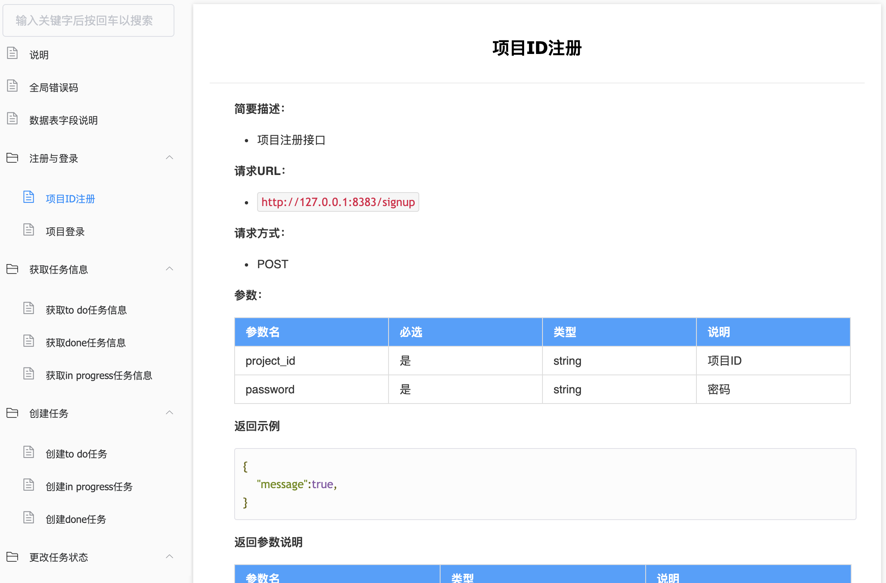

# Invincible Inc. 大作业项目 技术报告与经验总结 - 王明业

- [Invincible Inc. 大作业项目 技术报告与经验总结 - 王明业](#invincible-inc-大作业项目-技术报告与经验总结---王明业)
  - [0. 前言](#0-前言)
  - [1. 团队作业流程管理](#1-团队作业流程管理)
    - [I. 整体流程](#i-整体流程)
    - [II. 步骤：启动会议提纲](#ii-步骤启动会议提纲)
    - [III. 步骤：分配任务与进行任务](#iii-步骤分配任务与进行任务)
    - [IV. 步骤：整理验收](#iv-步骤整理验收)
    - [V. 流程管理方法总结](#v-流程管理方法总结)
  - [2. 团队作业流程用到的工具](#2-团队作业流程用到的工具)
    - [I. 微信群聊](#i-微信群聊)
    - [II. 腾讯会议](#ii-腾讯会议)
    - [III. 腾讯问卷](#iii-腾讯问卷)
    - [III. Github](#iii-github)
      - [a. 创建远程仓库](#a-创建远程仓库)
      - [b. 使用看板](#b-使用看板)
      - [c. 使用CI/CD工具](#c-使用cicd工具)
  - [3. 作业中用到的工具](#3-作业中用到的工具)
    - [I. 阿里云服务器](#i-阿里云服务器)
    - [II. SSH](#ii-ssh)
    - [III. Showdoc](#iii-showdoc)
    - [IV. Python: PyMySQL](#iv-python-pymysql)
    - [V. Python: Flask](#v-python-flask)
    - [VI. FileZilla](#vi-filezilla)
    - [VII. Gunicorn](#vii-gunicorn)
    - [VIII. Postman](#viii-postman)
    - [IX. Nginx](#ix-nginx)
  - [4. 感谢](#4-感谢)

## 0. 前言
在本学期IT项目管理课程中，我担任Invincible Inc. 小组的组长。我们小组是一个13人的团队。由于疫情的原因，这一学期以来的团队协作完全在线上进行，可以说是一段比较独特的团队经历。

作为组长，我需要负责团队整体的统筹与管理。此外也要完成每次作业中属于我的具体工作，与大家一同完成每次团队作业任务。所以我的总结既会涉及到管理方法经验，也会涉及到技术。

## 1. 团队作业流程管理

### I. 整体流程
每次团队作业的完成都遵循如下流程：

```
编写启动会议提纲 -> 召开启动会议 -> 分配任务 -> 进行任务 -> 整理验收 -> 提交
```

### II. 步骤：启动会议提纲
启动会议的提纲依据每次作业的内容编写。在会议提纲中，我按我的理解将作业问题提炼、分块，并相应地给出我想到的解决思路。

会议提纲会写在一个Word文档中，每次召开会议时，我会将该文档投屏，所有与会成员都能看到。并且在讨论过程中，有任何值得记录的讨论成果，我都会即时写入这个文档。

例：[第一次大作业（课件05的团队作业）启动会议提纲](https://docs.qq.com/doc/DYkdNT2xxc1dpaGdZ)

### III. 步骤：分配任务与进行任务
通过启动会议，我们会明确本次作业的具体任务以及每个具体任务对应的解决思路。在启动会议结束后的第一天上午，我会建立好此次作业的Github远程仓库，构造好作业文件目录，并给每项任务分配人手，将分工写入远程仓库的README中，然后发布群公告通知组员们可以开始完成各自的任务了。

例：[大作业代码仓库README](https://github.com/Invincible-Inc/Final-Work)

### IV. 步骤：整理验收
等到临近作业提交期限，我会验收组员们的作业内容，比较多的是排版上的小问题，例如：.md源文档里少打了一个空行，导致博客页面不能正常显示内容）。如有组员临近期限仍未完成，我会私聊以敦促其完成。

### V. 流程管理方法总结
总的来说，这样的流程使我们可以高效地完成团队作业。组长在召开启动会议前先对作业做思考，使启动会议在提纲描述的框架下召开，相比一切从零开始在会议中讨论，这样可以节省非常多的会议时间。

既然任务的分工也是由组长决定，那是不是可以让组长直接自己构思好整个作业的解决思路，然后自己定好分工并发布，不用再开会了呢？我觉得答案是否定的。首先，组长自己一个人的思路肯定比较局限，需要开会集思广益改良之，根据开会改良后的思路分配任务才更加正确；另外分工在会议之后确定，每位组员在开会时还不确定自己的分工，这样组员就会积极参与每个问题的讨论，如果预先定好了分工再开会，大家会更倾向于专注于自己负责的问题，不会对所有问题都仔细思考。

值得一提的是，在第一次大作业（课件05的团队作业）中，我完成了项目章程，其中包括了“项目角色及职责”表，描述了每个成员期望的岗位角色。后几次大作业的分工，我都参考了成员期望的岗位角色，尽量给每个成员分配符合他们期望的任务。

|       昵称       	|       期望岗位角色       	|                                  期望分工内容                                  	|
|:----------------:	|:------------------------:	|:------------------------------------------------------------------------------:	|
| Million Benjamin 	| 项目负责人、Python工程师 	| 使用Flask/Django框架进行后端搭建                                               	|
| shane            	| 项目经理或者客户经理     	| 分解需求和做PPT                                                                	|
| Alex             	| 产品经理，UI/UX设计师    	| 前端开发，产品规划                                                             	|
| Steve            	| 产品经理，DevOps工程师   	| 需求说明，运营反馈                                                             	|
| Wendy            	| 客户经理                 	| 需求调研等                                                                     	|
| Aivo             	| 产品经理，数据库DBA      	| 后台开发                                                                       	|
| carroll          	| js工程师                 	| 前端开发                                                                       	|
| Prince Bear      	| 项目经理，Java工程师     	| 移动端开发（Android）                                                          	|
| TD Wen           	| 数据库DBA                	| 数据库管理监控升级调优等及后台开发                                             	|
| George Wang      	| 客户经理、数据库DBA      	| 客户经理：客户访问&需求调查、客户分析与分类or数据库DBA：设计、安装、监控数据库 	|
| Spike            	| UI/UX设计师              	| 更喜欢搞UI这些                                                                 	|
| Axing            	| 产品经理                 	| 线框图，原型设计                                                               	|
| Jim Chan         	| 客户经理，产品经理       	| 因为代码能力非常非常薄弱，可能只能负责一些管理岗位，或者优化界面一类的工作     	|

## 2. 团队作业流程用到的工具

### I. 微信群聊

用于日常交流、发布通知等。

### II. 腾讯会议

用于召开各次会议。


### III. 腾讯问卷

用于收集成员信息。如收集信息以完成项目章程中的“项目角色及职责”表。


### III. Github

#### a. 创建远程仓库
用于协作完成文档：各成员将仓库pull到本地，完成后push。


#### b. 使用看板
在仓库页面的 `Project` 标签页，可创建看板。


#### c. 使用CI/CD工具
在仓库页面的 `Actions` 标签页，可创建CI流程。在编写本报告时，CI/CD流程在建立中。故此处图片展示的是原始的 `Actions` 页面。


## 3. 作业中用到的工具

我们小组打算实现一个可以注册、登录并使用看板的简单网站。我负责后端开发，我的工作包括接口文档的编写、RESTful API开发、API部署和API测试。并且由我租赁云服务器。

此处列举我在完成自己负责的任务时用到的工具，这些工具都是我切实使用了的。像MySQL数据库我们小组有用到，但我本人没有负责数据库的搭建与维护，所以在此不列举MySQL数据库。

### I. [阿里云服务器](https://www.aliyun.com/)
为使得网站可用，我在阿里云平台上租赁了一个轻量级服务器。


### II. [SSH](https://www.ssh.com/ssh/)
使用ssh远程登录到服务器，并进行命令行交互。

```shell
ssh [USERNAME]@[IP]
```


### III. [Showdoc](https://www.showdoc.cc/)

使用Showdoc进行网站接口文档的设计。

点击访问[本项目接口文档](https://www.showdoc.cc/959673659467626?page_id=5001600508651792)。




### IV. Python: [PyMySQL](https://github.com/PyMySQL/PyMySQL)

在Python程序中使用PyMySQL提供的接口以连接MySQL数据库并进行交互。

用 `connection` 方法创建连接实例；用 `connection.cursor.execute` 方法执行SQL语句，`connection.cursor.fetchall` 方法获取查询结果，`connection.commit` 方法提交更改。

作业中用于测试数据库连接的代码[test_KanbanDBManager.py](https://github.com/Invincible-Inc/Final-Work/blob/master/codes/Backend/test_KanbanDBManager.py)：

```python
import pymysql

'''
mysql -u root -p'123456' -h 120.25.251.110 -P 3306 -D schema_pm
'''

db_config = {
    "host": "120.25.251.110", 
    "port": 3306, 
    "user": "root", 
    "password": "123456", 
    "database": "schema_pm"
}

db_connection = pymysql.connect(host = db_config["host"], 
                                port = db_config["port"], 
                                user = db_config["user"], 
                                password = db_config["password"], 
                                database = db_config["database"])

db_connection.close()
```

### V. Python: [Flask](https://github.com/pallets/flask)

Flask是一个Python实现的Web开发微框架。作业中使用Flask开发后端 RESTful API。

作业中的后端代码[Kanban_api.py](https://github.com/Invincible-Inc/Final-Work/blob/master/codes/Backend/Kanban_api.py)

```python
DB_CONFIG = {
    "host": "120.25.251.110", 
    "port": 3306, 
    "user": "root", 
    "password": "123456", 
    "database": "schema_pm"
}

from KanbanDBManager import KanbanDBManager
from flask import Flask, abort, request, jsonify
from flask.views import MethodView

kanban_manager = KanbanDBManager(db_config = DB_CONFIG)

app = Flask(__name__)

class SignUp(MethodView):
    def post(self):
        json_data = request.get_json(force=True)
        return jsonify({"message": kanban_manager.sign_up_project(json_data["project_id"], json_data["password"])})
app.add_url_rule('/signup', view_func = SignUp.as_view(name='signup'))

class SignIn(MethodView):
    def post(self):
        json_data = request.get_json(force=True)
        return jsonify({"message": kanban_manager.sign_in_project(json_data["project_id"], json_data["password"])})
app.add_url_rule('/signin', view_func = SignIn.as_view(name='signin'))

class ToDo(MethodView):
    def get(self):
        project_id = str(request.args["project_id"])
        return jsonify({"todo": kanban_manager.get_todo_task(project_id)})
    def post(self):
        json_data = request.get_json(force=True)
        return jsonify({"message": kanban_manager.create_todo_task(json_data["project_id"], json_data["task_name"])})
app.add_url_rule('/todo', view_func = ToDo.as_view(name='todo'))

class InProgress(MethodView):
    def get(self):
        project_id = str(request.args["project_id"])
        return jsonify({"todo": kanban_manager.get_inprogress_task(project_id)})
    def post(self):
        json_data = request.get_json(force=True)
        return jsonify({"message": kanban_manager.create_inprogress_task(json_data["project_id"], json_data["task_name"])})
app.add_url_rule('/inprogress', view_func = InProgress.as_view(name='inprogress'))

class Done(MethodView):
    def get(self):
        project_id = str(request.args["project_id"])
        return jsonify({"todo": kanban_manager.get_done_task(project_id)})
    def post(self):
        json_data = request.get_json(force=True)
        return jsonify({"message": kanban_manager.create_done_task(json_data["project_id"], json_data["task_name"])})
app.add_url_rule('/done', view_func = Done.as_view(name='done'))

class Task(MethodView):
    def put(self):
        json_data = request.get_json(force=True)
        return jsonify({"message": kanban_manager.change_task_status(json_data["project_id"], json_data["task_name"], json_data["new_status"])})
    def delete(self):
        project_id = str(request.args["project_id"])
        task_name = str(request.args["task_name"])
        return jsonify({"message": kanban_manager.delete_task(project_id, task_name)})
app.add_url_rule('/task', view_func = Task.as_view(name='task'))

if __name__ == '__main__':
    app.run(host = "127.0.0.1", port = 8383)
```

### VI. [FileZilla](https://filezilla-project.org/)

FTP工具，用于在本机与服务器间的传输文件。


### VII. [Gunicorn](https://gunicorn.org/)

一个Python WSGI UNIX HTTP 服务端。和大多数的web框架兼容。

Gunicorn相比于Flask默认的WSGI服务器更加可靠。作业中使用Gunicorn运行后端。

进入 Kanban_api.py 文件所在目录，然后输入以下命令：
```shell
gunicorn -b 0.0.0.0:8383 Kanban_api:app
```

### VIII. [Postman](https://www.postman.com/)

作业中使用Postman进行API测试，向部署好的后端发送请求。

将[Ultimate Project Kanban API Test.postman_collection.json](https://github.com/Invincible-Inc/Final-Work/blob/master/codes/Backend/Ultimate%20Project%20Kanban%20API%20Test.postman_collection.json)导入（import）到Postman中即可查看。


### IX. [Nginx](https://nginx.org/en/)

一个高性能的HTTP和反向代理web服务器。作业中，在服务器上运行Nginx服务，以部署并启用前端Vue代码。

```bash
# Ubuntu上安装Nginx
sudo sudo apt install nginx

# 启动Nginx
service nginx restart

# 修改Nginx配置
vim /etc/nginx/sites-enabled/default
```

修改 `server` 模块下配置为：


然后把Vue项目build后得到的dist文件夹复制到 `/var/www/html`

重新加载Nginx配置：

```bash
nginx -s reload
```

访问[http://120.25.251.110/dist](http://120.25.251.110/dist)

网站成功运作。


## 4. 感谢

非常幸运能和这样一群优秀的同学共事，感谢小组成员对我的支持，同时他们也非常负责地完成了自己的工作，他们是（排名不分先后）：**温卓沛、幸赟、王嘉浚、王思博、王子豪、王子雄、吴明章、张佳蔚、张弛、黄冠纶、陈剑锋、顾子杉**。

非常感谢**潘茂林老师**的悉心教导，以及**徐慧颖**和**唐玄昭**两位TA的辛勤付出。IT项目管理是一门实践与理论紧密结合的课程，让人获益良多，这要归功于老师和TA的精心安排。