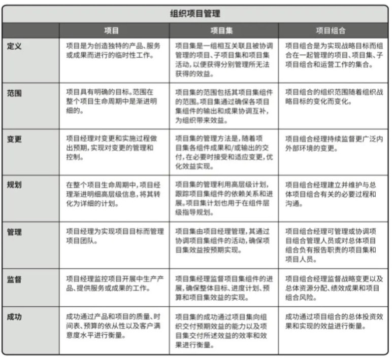
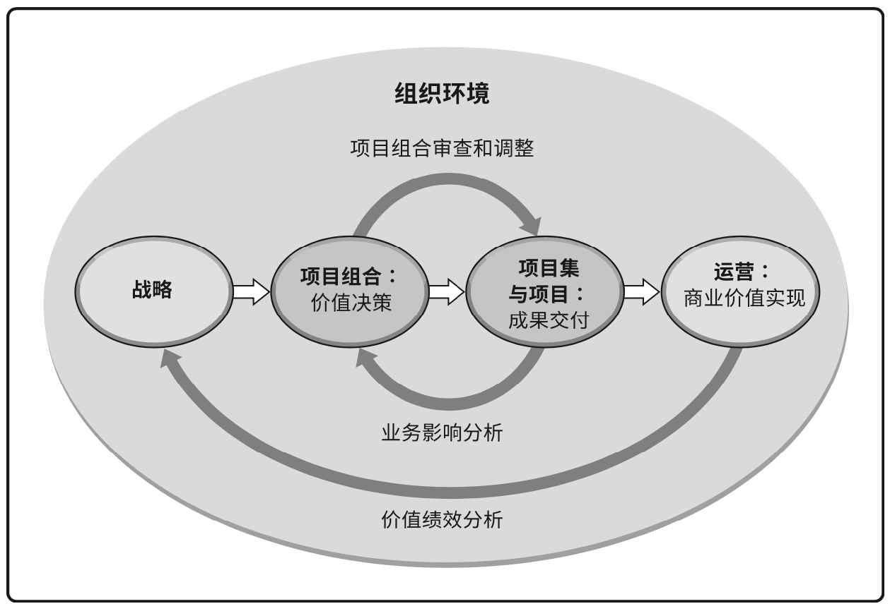

# projects、programs与portfolio，operations与OPM——关系、区别与案例

本文总阅读量次

- [projects、programs与portfolio，operations与OPM——关系、区别与案例](#projectsprograms%e4%b8%8eportfoliooperations%e4%b8%8eopm%e5%85%b3%e7%b3%bb%e5%8c%ba%e5%88%ab%e4%b8%8e%e6%a1%88%e4%be%8b)
  - [一、概念描述](#%e4%b8%80%e6%a6%82%e5%bf%b5%e6%8f%8f%e8%bf%b0)
    - [1. projects](#1-projects)
    - [2. programs](#2-programs)
    - [3. portfolio](#3-portfolio)
    - [4. operations](#4-operations)
    - [5. OPM](#5-opm)
  - [二、概念间的关系与区别](#%e4%ba%8c%e6%a6%82%e5%bf%b5%e9%97%b4%e7%9a%84%e5%85%b3%e7%b3%bb%e4%b8%8e%e5%8c%ba%e5%88%ab)
    - [1. projects、programs、和 portfolio 之间的关系与区别](#1-projectsprograms%e5%92%8c-portfolio-%e4%b9%8b%e9%97%b4%e7%9a%84%e5%85%b3%e7%b3%bb%e4%b8%8e%e5%8c%ba%e5%88%ab)
      - [I. 关系](#i-%e5%85%b3%e7%b3%bb)
      - [II. 区别](#ii-%e5%8c%ba%e5%88%ab)
    - [2. operations与OPM之间的关系](#2-operations%e4%b8%8eopm%e4%b9%8b%e9%97%b4%e7%9a%84%e5%85%b3%e7%b3%bb)
  - [三、案例列举](#%e4%b8%89%e6%a1%88%e4%be%8b%e5%88%97%e4%b8%be)
  - [四、projects、programs 和 portfolio 对企业成功的贡献](#%e5%9b%9bprojectsprograms-%e5%92%8c-portfolio-%e5%af%b9%e4%bc%81%e4%b8%9a%e6%88%90%e5%8a%9f%e7%9a%84%e8%b4%a1%e7%8c%ae)

## 一、概念描述

### 1. projects

即项目。项目是为创造独特的产品、服务或成果而做的临时性工作。

### 2. programs
即项目集。项目集是一组相互关联且被协调的项目、子项目集和项目集活动，以便获得分布管理所无法获得的效益。

### 3. portfolio
即项目组合。项目组合是指为实现战略目标而协调管理的项目、项目集和子项目组合和运营工作。

### 4. operations
即运营（运营管理）。运营管理关注产品的持续生产和(或)服务的持续运作。项目与运营会在产品生命周期的不同时点交叉。

### 5. OPM
即组织级项目管理。OPM指为实现战略目标而整合项目组合、 项目集和项目管理与组织驱动因素的框架。旨在确保组织开展正确的项目并合适地分配关键资源。

## 二、概念间的关系与区别
### 1. projects、programs、和 portfolio 之间的关系与区别
#### I. 关系
- 项目组合组成部分合为一组能够促进这项工作的有效治理和管理，从而有助于实现组织战略和相关优先级。
- 在开展组织和项目组合规划时，要基于风险、资金和其他考虑因素对项目组合组件排列优先级
- 项目组合方法有利于组织了解战略目标在项目组合中的实施情况，还能促进适当项目组合、项目集和项目治理的实施和协调。这种协调治理方式可为实现预期绩效和效益而分配人力、财力和实物资源。

具体关系示意见下图：

#### II. 区别
- 项目集和项目管理的重点在于 __以“正确”的方式__ 开展项目集和项目
- 项目组合管理则注重于 __开展“正确”的__ 项目集和项目。

具体比较见下表：

### 2. operations与OPM之间的关系
运营和战略、项目组合、项目集、项目一起在OPM的组织环境下相互作用。

## 三、案例列举
以中山大学为例：
- __OPM__：中山大学致力于成为世界一流大学，为了实现“成为世界一流大学”的战略目标，校方积极开展教学、科研、合作、校园生活体验、行政等等方面的优化提升项目，并为各项举措合理分配资源，形成一整套行动框架。
  
- __portfolio__：为提升师生及其他工作人员的校园生活效率，提出了一套“校园生活效率提升项目组合”。其中包括门户网站的建设、管理系统的建设、校园生活综合App的开发。
  
- __programs__：“校园生活效率提升项目组合”中的一个关键项目集——校园生活综合App。旨在让广大师生能在移动端方便地使用各项功能。
  
- __projects__：为了让现有各项功能能方便地集成到App中，并且为了日后能简便地向App中添加功能，决定将各项功能以小程序的方式集成到校园生活综合App中。这里的各项功能（每个小程序）即是一个项目。

- __operations__：宣传、推广校园生活综合App。对于App的使用，不断总结用户反馈，持续优化现有功能。同时发掘用户需求，开发新功能。这些过程属于运营。

## 四、projects、programs 和 portfolio 对企业成功的贡献

企业向着战略目标进军。

portfolio规划了整体的进军路线。兵分几路、走哪些路。

programs规划每条路上应该做什么。A路线建桥过河；B路线造船过海；C路线
开仓济民。

projects是每条进军路线中的每一小步，路上的每个小任务。

projects、programs 和 portfolio让企业有大计划，也有踏实的每一步，让企业在实现战略目标的征途中稳步前进。
