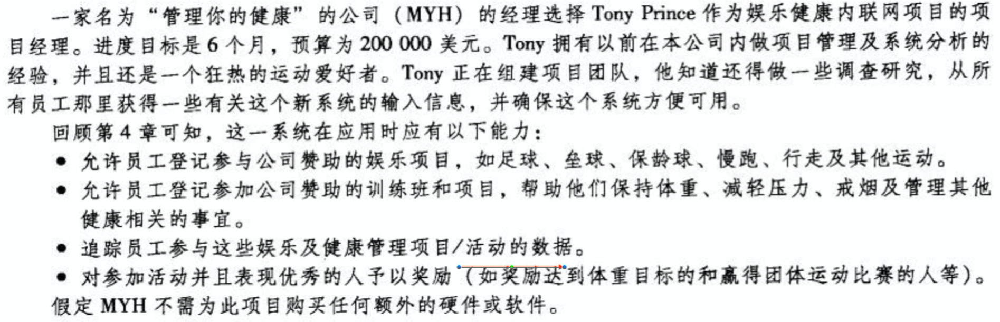
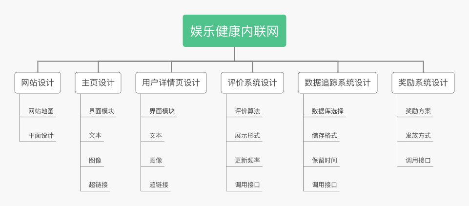
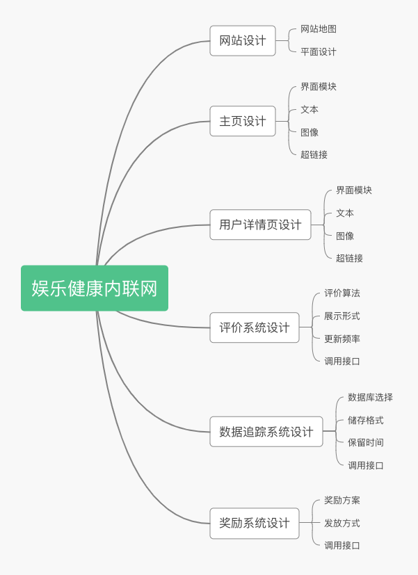

# 收集需求与定义范围

## 一、娱乐健康内联网项目（《IT项目管理》第6版 P123）需求收集方法报告

操作案例：

### 1. 阅读[本项目的项目章程](https://millionbenjamin.github.io/IT-Project-Management/homework4/content#%E4%B8%80myh%E5%85%AC%E5%8F%B8%E7%9A%84%E4%BC%91%E9%97%B2%E5%92%8C%E5%81%A5%E5%BA%B7%E7%BD%91%E7%AB%99%E9%A1%B9%E7%9B%AE%E7%AB%A0%E7%A8%8B)

项目章程包含了项目的高层次需求或者指出其他列出需求的文件。任何收集到的需求，应当满足项目章程和利益相关者记录中的要求。

由项目章程中的项目目标可知，本项目的最高层次需求是：
- 于6个月内，在现有的网络上再提供一个帮助员工改善健康状况的应用程序。
- 应用整体投入使用后的1年内帮助提高员工健康状况，使得公司可以与保险商商讨较低的医疗保险费用。并在接下来4年里平均每年每名全职员工净节省30%。

### 2. 引导式研讨会-现场会
邀请主要的跨职能干系人一起参加会议，对产品需求进行集中讨论与定义。研讨会可以快速定义跨职能需求和协调干系人差异。

由于群体互动的特点，被有效引导的研讨会有助于建立信任、促进关系、改善沟通，有利于参加者达成一致意见，并且能够比单项会议更快地发现和解决问题。

本项目的引导式研讨会的与会人员包括但不限于：
- 项目经理 Tony Prince
- 项目技术人员代表
- 公司CEO
- 员工代表
- 财务部门代表（预算具体拨款计划、奖励方案-物质/金钱）
- 人事部门代表（员工数据获取方式、奖励方案-假期）
- 法务部门代表（项目可能存在的合法性问题，如数据的收集与追踪）

并且需要保证：
- 与会人员对实际问题拥有发言权并能对所属职能部门进行决策
- 现场会必须形成会议结论并具有可执行性
- 形成的会议决议应立即生效并应得到快速执行

研讨会可能会得出项目需要：公司财务系统接口、项目组与公司财务部的对接流程、公司人事系统接口、项目组与公司人事部的对接流程、项目组与公司法务部的对接流程、员工意见收集流程等。

### 3. 召开焦点小组会议

把预先选定的干系人和主题专家集中在一起，了解他们对所提议产品、服务或成果的期望和态度，通常是在项目团队所在的职能部门内进行。由主持人引导大家进行互动式讨论。焦点小组会议相比引导式研讨会规模较小。

在公司内部项目团队组建完成，且确定外部顾问人选后，聚集项目团队、顾问召开焦点小组会议。可由项目经理主持

焦点小组会议可能会得出项目需要：项目团队增加一名架构师、项目团队增加一名DBA。

### 4. 原型法 + 员工问卷调查

现已知项目的成品系统应具备那些能力，可以根据此信息快速地构造出一个初始系统原型。让用户看到未来系统的概貌，以便判断哪些功能是符合要求的，哪些方面还需要改进，然后不断地对这些需求进一步补充、细化和修改。依次类推，反复进行，直到用户满意为止并由此开发出完整的系统。即不断地运行系统的"原型"来进行揭示、判断、修改和完善需求。

系统演变的每个版本发布一段时间后，对全体使用系统的员工进行问卷调查，询问用户使用体验和建议等，统计调查结果，作为下一次演变的指导之一。

问卷调查可能会得出项目需要：每次新运动娱乐项目/训练班开始报名前做邮件通知、经过员工本人同意后可在网站上展示优秀员工参与情况

### 5. 需求跟踪矩阵

需求跟踪矩阵如下表所示。若矩阵表无法完全显示，可以横向滑动表区域以查看完整内容，或者在[Github仓库页面](https://github.com/MIllionBenjamin/IT-Project-Management/blob/master/homework5/content.md)查看（注意仓库页面的Markdown文档无法正常加载图片，请在阅览本矩阵表后**返回当前博客页面**继续阅览内容）。

| 需求序号 	| 名称                                                          	| 种类         	| 需求源                	| 状态   	|
|----------	|---------------------------------------------------------------	|--------------	|-----------------------	|--------	|
| 001      	| 6个月内上线应用                                               	| 项目目标要求 	| 项目章程              	| 进行中 	|
| 002      	| 应用投入使用后1年内帮助提高员工健康状况，降低员工医疗保险费用 	| 项目目标要求 	| 项目章程              	| 进行中 	|
| 003      	| 公司财务系统接口                                              	| 软件         	| 引导式研讨会          	| 已完成 	|
| 004      	| 项目组与公司财务部的对接流程                                  	| 文档         	| 引导式研讨会          	| 已完成 	|
| 005      	| 公司人事系统接口                                              	| 软件         	| 引导式研讨会          	| 已完成 	|
| 006      	| 项目组与公司人事部的对接流程                                  	| 文档         	| 引导式研讨会          	| 已完成 	|
| 007      	| 项目组与公司法务部的对接流程                                  	| 文档         	| 引导式研讨会          	| 已完成 	|
| 008      	| 员工意见收集流程                                              	| 文档         	| 引导式研讨会          	| 已完成 	|
| 009      	| 项目架构师                                                    	| 人力         	| 焦点小组会议          	| 已完成 	|
| 010      	| 项目DBA                                                       	| 人力         	| 焦点小组会议          	| 已完成 	|
| 011      	| 每次新运动娱乐项目/训练班开始报名前做邮件通知                 	| 应用功能     	| 原型法 + 员工问卷调查 	| 进行中 	|
| 012      	| 经过本人同意后可在网站上展示优秀员工参与情况                  	| 应用功能     	| 原型法 + 员工问卷调查 	| 进行中 	|

## 二、娱乐健康内联网项目WBS

以树状组织结构思维导图形式构建的WBS如下图所示：

以一般思维导图形式构建的WBS如下图所示：

其中的工作包满足可管理性要求，以主页设计为例：
- 能计算时间：界面模块设计在一周内完程；文本设计在三个工作日内完成；图像制作在一周内完成；超链接选择在两个工作日内完成。合计15个工作日内完成。
- 能赋予(人力)资源，包括负责人：产品经理、UI/UX工程师负责界面模块设计；产品经理负责文本设计；美工/媒体设计师负责图像制作；产品经理选择超链接配置。
- 能给出成本预算模型：成本预算包括在工作者工资发放中。对于“主页设计”，详细情况是：产品经理十个工作日的工资发放；UI/UX工程师五个工作日的工资发放；美工/媒体设计师五个工作日的工资发放。
- 它具有明确的任务或活动以及相关成果：主页设计的成果应当一个是界面美观、模块完全、易于使用的网站主页。

并且这样的WBS是完整分解的，以数据追踪系统设计为例，其下的子项工作无法再分，并且所有子项工作完成后，数据追踪系统的设计变完成了。并且如果不进行数据追踪系统的设计，娱乐健康内联网项目一定无法完成。

