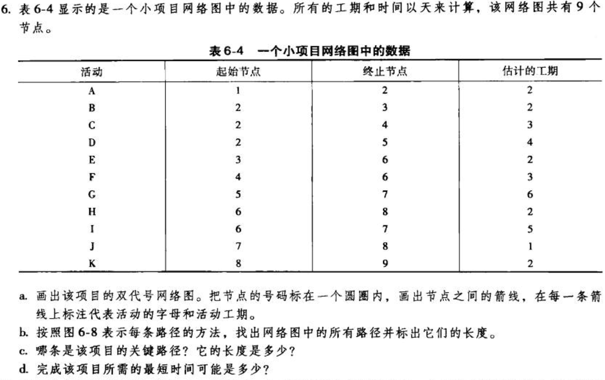
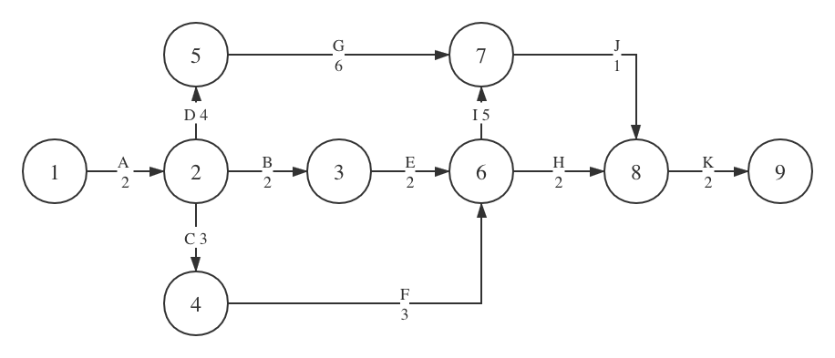
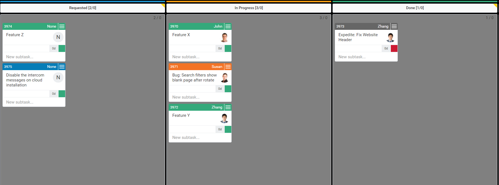
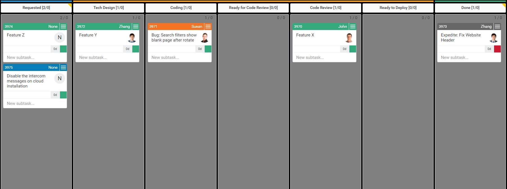
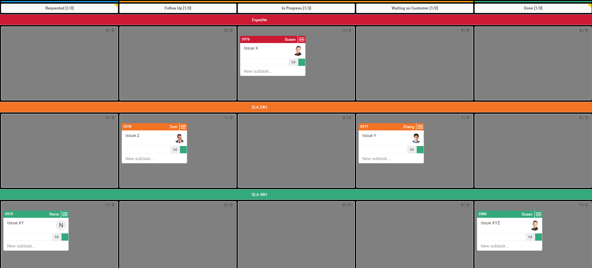
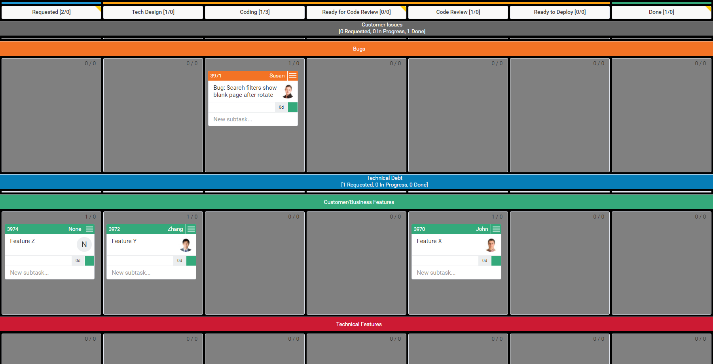
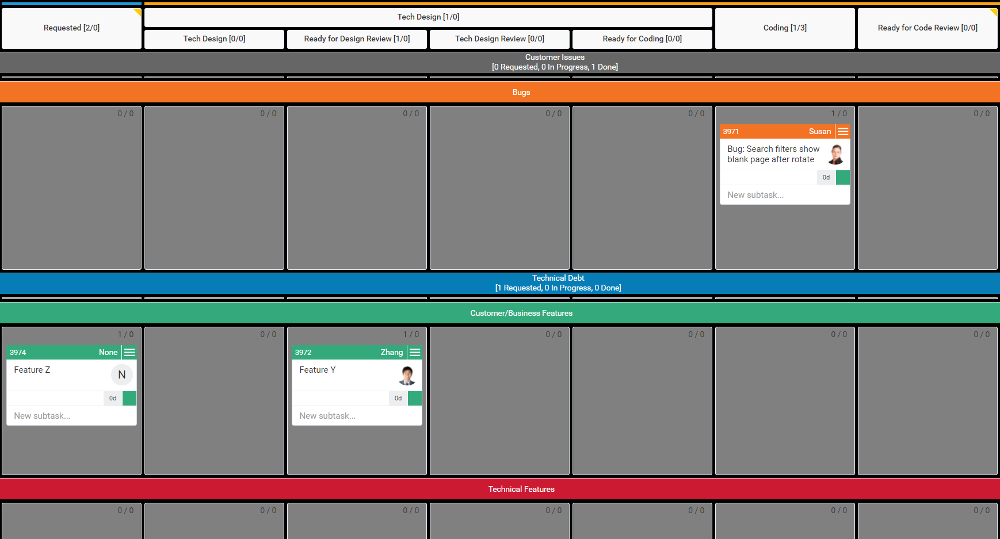
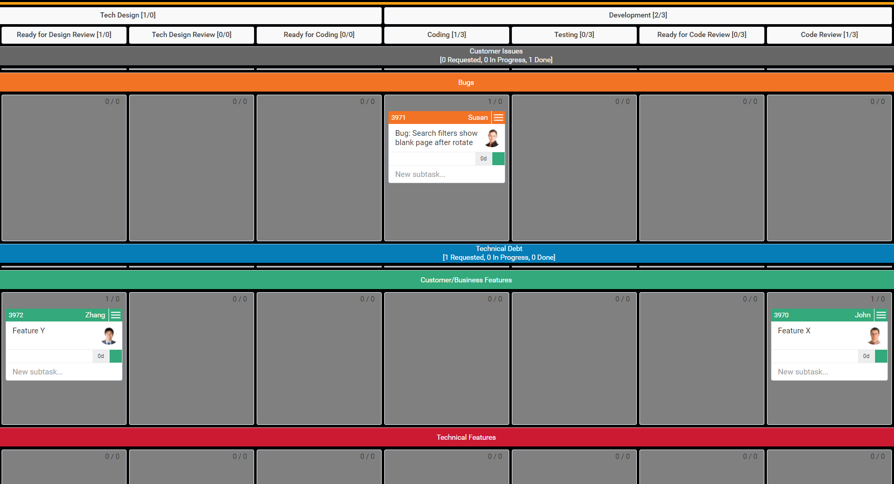
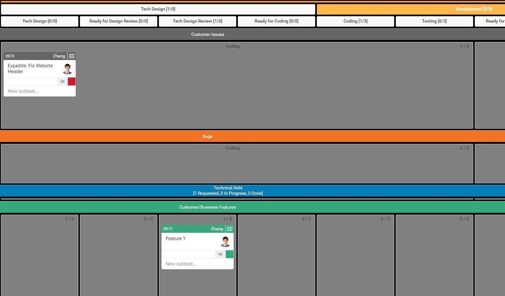
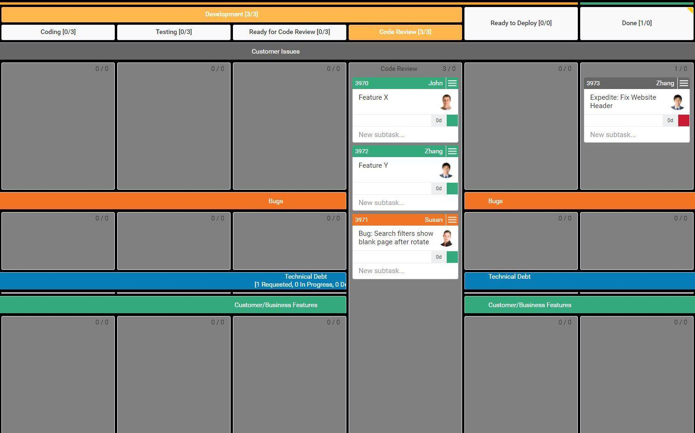

# 项目时间管理 练习

- [项目时间管理 练习](#项目时间管理-练习)
  - [一、教材练习题6（P149 6. ）](#一教材练习题6p149-6-)
    - [a. 双代号网络图](#a-双代号网络图)
    - [b. 所有路径与长度](#b-所有路径与长度)
    - [c. 关键路径与其长度](#c-关键路径与其长度)
    - [d. 可能的项目最短完成时间](#d-可能的项目最短完成时间)
  - [二、教材练习题7（P149 7. ）](#二教材练习题7p149-7-)
  - [三、看板在软件项目中的使用](#三看板在软件项目中的使用)
    - [看板使用指南：从三列看板到灵活的布局设计](#看板使用指南从三列看板到灵活的布局设计)
      - [关键要点](#关键要点)
      - [从你所在的位置开始](#从你所在的位置开始)
      - [基本看板的局限性](#基本看板的局限性)
      - [如何进行精确的工作流映射](#如何进行精确的工作流映射)
        - [可能的列](#可能的列)
        - [可能的泳道](#可能的泳道)
      - [释放看板工作流程的力量](#释放看板工作流程的力量)
        - [横向映射实验](#横向映射实验)
        - [优化你的泳道](#优化你的泳道)
      - [关于作者](#关于作者)

## 一、教材练习题6（P149 6. ）

题目：

### a. 双代号网络图
按要求画得双代号网络图如下所示

### b. 所有路径与长度
- 路径1：`A-D-G-J-K`    长度 = 2 + 4 + 6 + 1 + 2 = 15
- 路径2：`A-B-E-I-J-K`    长度 = 14
- 路径3：`A-B-E-H-K`    长度 = 2 + 2 + 2 + 2 + 2 = 10
- 路径4：`A-C-F-I-J-K`    长度 = 2 + 3 + 3 + 5 + 1 + 2 = 16
- 路径5：`A-C-F-H-K`    长度 = 2 + 3 + 3 + 2 + 2 = 12

### c. 关键路径与其长度
关键路径即最长路径为：路径4 `A-C-F-I-J-K`    长度 = 2 + 3 + 3 + 5 + 1 + 2 = 16

### d. 可能的项目最短完成时间

## 二、教材练习题7（P149 7. ）

## 三、看板在软件项目中的使用

### [看板使用指南：从三列看板到灵活的布局设计](https://www.infoq.cn/article/kanban-step-guide)

> Author: Alex Novkov
> 
> Translator: 无明
> 
> 05.2018

#### 关键要点
- 盲目实现复杂的看板很可能会导致长期失败。
- 在熟练使用看板后，需要详细的工作流程图来优化流程。
- 应该将最重要的流程步骤放到看板的列中。
- 借助泳道将相似的活动分组，并根据优先级安排工作流程。
- 使用每个泳道的不同列创建灵活的工作流有助于充分发挥工作流程的潜力。

看板的受欢迎程度日益增长。这种方法适用于各种行业，比如从建筑行业到营销行业。因为使用了这种方法，数以百万计的人产出更好的结果。

虽然实现看板看起来相当简单，但只有那些愿意尝试自己的工作流程并且将测试结果反映到实际步骤中的人才能够充分利用该方法。

在下面的段落中，你将看到实现看板的最常见阶段，并在逐渐熟练掌握该方法时学习如何提高工作流可视化和控制程度。

坚持到最后一刻，看看如何在不造成混乱的情况下，优化团队流程中的每一个步骤。

#### 从你所在的位置开始
如果你的团队刚刚开始使用看板，绝对不要急于绘制出复杂的设计图或设置难以遵循的 WIP 限制。花一些必要的时间让你的团队参与进来，让他们有机会做一些基础练习。

看板的最简单变体由三个列组成：

- 已请求
- 进行中
- 已完成

这种基本的看板布局对于没有看板经验的团队来说是非常有用的，因为它很容易引起人们对工作流可视化的兴趣。这样有助于养成根据任务状态来移动卡片的习惯，这是一个很好的开始。

让团队成员自己去拉取工作任务，可以更好地建立起流程管理。

这种看板布局很容易就可以保持最新状态，并为 WIP 限制（看板的基础之一）打下了坚实的基础，对于使用物理白板来实现看板的团队来说尤其如此。

#### 基本看板的局限性
通常，最基本的看板足以为团队工作方式带来可见的改进，但很快会遇到瓶颈。

等你熟悉了看板，就会注意到三列看板的局限性，特别是当你在知识密集型的工作环境中使用看板时。

对于初学者来说，可以限制正在进行的总任务量，他们可以看到每一项已经开始的任务，但不知道每个任务的状态。

你可能知道某人正在进行某项任务，但除非去找他要一份状态报告，否则就无法知道这个人是否正在积极地处理任务或在等待什么。

因此，可以说，基本看板除了让你可以限制正在进行的工作量之外，它能够提供的工作流程可见性和改进指导是非常有限的。

#### 如何进行精确的工作流映射
在团队熟悉了看板之后，应该向看板中添加几个列和几个泳道，以获得更准确的工作流程视图。

这样有助于看到改善团队工作方式的潜在机会，并实验流程的不同步骤。

##### 可能的列
例如，在软件开发方案中，可以将“进行中”分成多个列，代表流程中最重要的几个步骤，如：

- 技术设计
- 编码
- 准备好代码评审
- 代码评审
- 准备部署

通过将“正在进行”分解为五个独特的步骤，你就可以看到每项任务的进度，而不会让看板变得太复杂，以致于团队无法理解。此外，你将能够可视化开发过程中最常见的一个阶段——评审阶段。

##### 可能的泳道
在使用额外的列完善看板的布局之后，可以添加一些泳道，以使工作流可视化更加精确。

泳道一般按照优先级或活动进行分类。通常情况下，IT Ops 团队会优先按照优先级划分看板。这种情况下的标准垂直布局是这样的：

- 加速
- SLA 24 小时
- SLA 48 小时

逻辑很简单，就是你的团队根据优先级开始新的任务。例如，如果你在“已请求”中有加速卡，那么就暂停所有其他操作（除非是另一个加速卡）并立即开始处理加速卡中的任务。遵循这一思路，最后将卡片从 SLA 48 中移走。

根据工作类型分解看板是软件开发团队的常见做法。例如，开发团队的一些泳道如下：

- 客户问题
- Bug
- 技术债务
- 客户 / 业务功能
- 技术特性

与优先级泳道看板布局类似，这个看板上的任务由开发人员从最高位置的泳道中拉出。逻辑几乎是一样的，顶部泳道包含最重要的卡片类型。

这里有一个问题，在上述的两种情况下都是根据优先级拉取卡片，那么根据工作类型对卡进行分组又有什么意义？

答案隐藏在“计划”当中。虽然看板没有规定计划机制，但在软件开发中，这在一定程度上是必要的。

例如，产品的 bug 很少，技术债务很少，甚至是没有，这是很重要的，但如果你想在这样一个充满活力的市场中生存下去，就不能完全停止开发新功能。

简而言之，根据作业类型将卡分组在泳道中，可以优化团队的能力，并以最有利的方式为客户和雇主保持工作流程。

#### 释放看板工作流程的力量

通过实践上述的知识，就能够构建出坚实的看板工作流程，从多个方面来看，这样的工作流程已经算得上是先进的。不过，这种方法可以给你带来的好处远不止这些。

##### 横向映射实验
对流程中最重要的步骤进行可视化足以优化工作流程，但还达不到先进的程度。只要你和你的团队适应了看板，就应该对你的工作流程中的所有重要步骤进行详细的横向映射。

只有这样，你才能够精确地发现瓶颈，并通过放置阶段 / 列 WIP 限制来组织特定步骤的吞吐量，以确保瓶颈不会堵塞（如果无法移除瓶颈或不值得这么做）。

重点应集中在看板“进行中”部分。

例如，将开发过程的每个重要步骤分解为几个较小的步骤。

可以将技术设计步骤分成四个不同的列：

- 技术设计
- 准备好设计评审
- 技术设计评审
- 准备好编码

下一步，将实际的开发分解成另外四列：

- 编码
- 测试
- 准备好代码评审
- 代码评审

你甚至可以将软件开发的最后一步（部署）分解成多个步骤，如：
- 准备进入生产环境测试
- 进行生产环境测试

我们可以清楚地看到，这样的看板布局为我们提供了关于团队任务状态的更多信息。你正在寻找稳定的工作流程和增加团队完成的任务数量，所以可以尽可能多地尝试使用看板的列。

##### 优化你的泳道
看板泳道的主要功能是组合相似的卡片。因此，只有当看板能够让任务以一种非常稳定且快速的方式向最终交付目标前进时，才能称得上是充分利用了看板的优势。

所以在这个阶段，我们不应该犹豫去打破典型的看板限制，并通过在每个泳道上放置特定列来推进看板工作流程。

让我们将其付诸实践。如果回到软件开发看板，我们可以很容易看到之前提到的几个列被完美地映射到一个新的泳道中。

但是，在这个看板中，有一些任务是处理客户问题和修复错误。它们需要更多的灵活性，而且在大多数情况下，每一个都要经过 10 个步骤，这是没有必要的。

在已部署功能遇到问题时，通常会直接从编码阶段启动卡片。问题解决后，需要进行快速评审，以确定卡片上所写的内容是否可行，然后直接进入部署阶段。

在这种情况下，我们可以合并技术设计、编码和测试。为此，我们创建了这些泳道，用于问题修复，这样就变得更加灵活。

我们甚至可以考虑跨泳道进行垂直列合并。对于依赖相同人员进行所有泳道卡片评审的团队来说，这是一个完美的方案。如果进行横跨泳道的垂直合并代码评审列，则提交评审的所有卡片都将显示在看板的顶部。

这样就可以保留所有等待评审的卡片，并让责任利益相关方更容易在适当的时间处理它们。我们甚至可以将一个单独的 WIP 限制放置在待评审状态，并在达到限制后立即进行批量评审。

即使对于高级的看板实践者来说，合并列仍然是在不增加看板复杂度的情况下实现灵活看板结构的最佳方法。在考虑每个泳道的工作流程步骤时，应该牢记这一点。

是的，你可以将团队所有的工作流程映射到单个看板上，并且每个泳道的步骤完全不同，但是这样更容易造成混乱。

总而言之，看板乍一看起来很简单。掌握看板方法并充分利用看板的优势需要进行大量的练习和实验。从三列看板到灵活的工作流程设计可能需要几个月的时间。

不要因此而灰心，持续改进并逐步推进你的看板工作流程。

#### 关于作者
Alex Novkov 是[看板软件开发公司Kanbanize](https://kanbanize.com/)的内容负责人。他是一个经验丰富的看板实践者，致力于帮助全世界人们提高工作效率。

