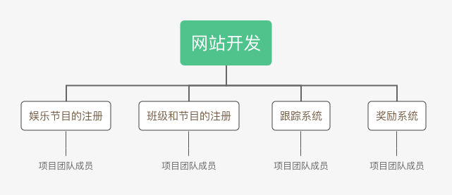

# 项目成本管理 练习

- [项目成本管理 练习](#项目成本管理-练习)
  - [一、教材操作案例题1（P172 1. ）](#一教材操作案例题1p172-1-)
    - [1. WBS构建](#1-wbs构建)
    - [2. 成本模型](#2-成本模型)
  - [二、教材操作案例题2（P173 2. ）](#二教材操作案例题2p173-2-)
  - [三、教材操作案例题3（P173 3. ）](#三教材操作案例题3p173-3-)

## 一、教材操作案例题1（P172 1. ）
题目：

### 1. WBS构建
对于给定的WBS条目，构建如下WBS：

### 2. 成本模型

成本模型如下表所示（如横向显示不全，请横向滑动查看）：

|        WBS条目       	| 数量或小时数 	| 单位小时成本      （美元） 	| 子层总和      （美元） 	| WBS第2层总和      （美元） 	| 占总和的% 	|
|:--------------------:	|:------------:	|:-----------------------------:	|:-------------------------:	|:-----------------------------:	|:---------:	|
| 1. 项目管理          	|              	|                               	|                           	|             70400             	|     40    	|
| 项目经理             	|      320     	|              100              	|           32000           	|                               	|           	|
| 项目团队成员         	|      640     	|               60              	|           38400           	|                               	|           	|
| 2. 需求定义          	|              	|                               	|                           	|             12000             	|     7     	|
| 用户角色的调查与构建 	|      40      	|              100              	|            4000           	|                               	|           	|
| 使用场景的总结与描述 	|      40      	|              100              	|            4000           	|                               	|           	|
| 用户问题的分析与定义 	|      40      	|              100              	|            4000           	|                               	|           	|
| 3. 网站设计          	|              	|                               	|                           	|             16000             	|     9     	|
| 3.1 娱乐节目的注册   	|      40      	|              100              	|            4000           	|                               	|           	|
| 3.2 班级和节目的注册 	|      40      	|              100              	|            4000           	|                               	|           	|
| 3.3 跟踪系统         	|      40      	|              100              	|            4000           	|                               	|           	|
| 3.4 奖励系统         	|      40      	|              100              	|            4000           	|                               	|           	|
| 4. 网站开发          	|              	|                               	|                           	|             48000             	|     27    	|
| 4.1 娱乐节目的注册   	|      200     	|               60              	|           12000           	|                               	|           	|
| 4.2 班就和节目的注册 	|      200     	|               60              	|           12000           	|                               	|           	|
| 4.3 跟踪系统         	|      200     	|               60              	|           12000           	|                               	|           	|
| 4.4 奖励系统         	|      200     	|               60              	|           12000           	|                               	|           	|
| 5. 测试              	|              	|                               	|                           	|              9600             	|     5     	|
| 静态测试             	|      80      	|               60              	|            4800           	|                               	|           	|
| 动态测试             	|      80      	|               60              	|            4800           	|                               	|           	|
| 6. 测试、运行和支持  	|              	|                               	|                           	|             19200             	|     11    	|
| 上线测试、运行       	|      120     	|               60              	|            7200           	|                               	|           	|
| 运营与支持           	|      120     	|              100              	|           12000           	|                               	|           	|
| **总项目成本估计**       	|              	|                               	|                           	|             175200            	|           	|

## 二、教材操作案例题2（P173 2. ）
题目：

成本基线如下表所示（如横向显示不全，请横向滑动查看）：

|        WBS条目       	| 数量或小时数 	| 单位小时成本      （美元） 	| 子层总和      （美元） 	| WBS第2层总和      （美元） 	| 占总和的% 	|
|:--------------------:	|:------------:	|:-----------------------------:	|:-------------------------:	|:-----------------------------:	|:---------:	|
| 1. 项目管理          	|              	|                               	|                           	|             70400             	|     40    	|
| 项目经理             	|      320     	|              100              	|           32000           	|                               	|           	|
| 项目团队成员         	|      640     	|               60              	|           38400           	|                               	|           	|
| 2. 需求定义          	|              	|                               	|                           	|             12000             	|     7     	|
| 用户角色的调查与构建 	|      40      	|              100              	|            4000           	|                               	|           	|
| 使用场景的总结与描述 	|      40      	|              100              	|            4000           	|                               	|           	|
| 用户问题的分析与定义 	|      40      	|              100              	|            4000           	|                               	|           	|
| 3. 网站设计          	|              	|                               	|                           	|             16000             	|     9     	|
| 3.1 娱乐节目的注册   	|      40      	|              100              	|            4000           	|                               	|           	|
| 3.2 班级和节目的注册 	|      40      	|              100              	|            4000           	|                               	|           	|
| 3.3 跟踪系统         	|      40      	|              100              	|            4000           	|                               	|           	|
| 3.4 奖励系统         	|      40      	|              100              	|            4000           	|                               	|           	|
| 4. 网站开发          	|              	|                               	|                           	|             48000             	|     27    	|
| 4.1 娱乐节目的注册   	|      200     	|               60              	|           12000           	|                               	|           	|
| 4.2 班就和节目的注册 	|      200     	|               60              	|           12000           	|                               	|           	|
| 4.3 跟踪系统         	|      200     	|               60              	|           12000           	|                               	|           	|
| 4.4 奖励系统         	|      200     	|               60              	|           12000           	|                               	|           	|
| 5. 测试              	|              	|                               	|                           	|              9600             	|     5     	|
| 静态测试             	|      80      	|               60              	|            4800           	|                               	|           	|
| 动态测试             	|      80      	|               60              	|            4800           	|                               	|           	|
| 6. 测试、运行和支持  	|              	|                               	|                           	|             19200             	|     11    	|
| 上线测试、运行       	|      120     	|               60              	|            7200           	|                               	|           	|
| 运营与支持           	|      120     	|              100              	|           12000           	|                               	|           	|
| 总项目成本估计       	|              	|                               	|                           	|             175200            	|           	|

## 三、教材操作案例题3（P173 3. ）
题目：

