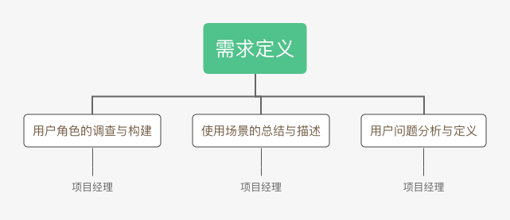

# 项目成本管理 练习

- [项目成本管理 练习](#项目成本管理-练习)
  - [一、教材操作案例题1（P172 1. ）](#一教材操作案例题1p172-1-)
    - [1. WBS构建](#1-wbs构建)
    - [2. 成本模型](#2-成本模型)
  - [二、教材操作案例题2（P173 2. ）](#二教材操作案例题2p173-2-)
  - [三、教材操作案例题3（P173 3. ）](#三教材操作案例题3p173-3-)
    - [a.](#a)
    - [b.](#b)
    - [c.](#c)
    - [d.](#d)

## 一、教材操作案例题1（P172 1. ）
题目：

### 1. WBS构建
对于给定的WBS条目，构建如下WBS：

### 2. 成本模型

成本模型如下表所示（如横向显示不全，请横向滑动查看）：

|        WBS条目       	| 数量或小时数 	| 单位小时成本      （美元） 	| 子层总和      （美元） 	| WBS第2层总和      （美元） 	| 占总和的% 	|
|:--------------------:	|:------------:	|:-----------------------------:	|:-------------------------:	|:-----------------------------:	|:---------:	|
| 1. 项目管理          	|              	|                               	|                           	|             70400             	|     40    	|
| 项目经理             	|      320     	|              100              	|           32000           	|                               	|           	|
| 项目团队成员         	|      640     	|               60              	|           38400           	|                               	|           	|
| 2. 需求定义          	|              	|                               	|                           	|             12000             	|     7     	|
| 用户角色的调查与构建 	|      40      	|              100              	|            4000           	|                               	|           	|
| 使用场景的总结与描述 	|      40      	|              100              	|            4000           	|                               	|           	|
| 用户问题的分析与定义 	|      40      	|              100              	|            4000           	|                               	|           	|
| 3. 网站设计          	|              	|                               	|                           	|             16000             	|     9     	|
| 3.1 娱乐节目的注册   	|      40      	|              100              	|            4000           	|                               	|           	|
| 3.2 班级和节目的注册 	|      40      	|              100              	|            4000           	|                               	|           	|
| 3.3 跟踪系统         	|      40      	|              100              	|            4000           	|                               	|           	|
| 3.4 奖励系统         	|      40      	|              100              	|            4000           	|                               	|           	|
| 4. 网站开发          	|              	|                               	|                           	|             48000             	|     27    	|
| 4.1 娱乐节目的注册   	|      200     	|               60              	|           12000           	|                               	|           	|
| 4.2 班就和节目的注册 	|      200     	|               60              	|           12000           	|                               	|           	|
| 4.3 跟踪系统         	|      200     	|               60              	|           12000           	|                               	|           	|
| 4.4 奖励系统         	|      200     	|               60              	|           12000           	|                               	|           	|
| 5. 测试              	|              	|                               	|                           	|              9600             	|     5     	|
| 静态测试             	|      80      	|               60              	|            4800           	|                               	|           	|
| 动态测试             	|      80      	|               60              	|            4800           	|                               	|           	|
| 6. 测试、运行和支持  	|              	|                               	|                           	|             19200             	|     11    	|
| 上线测试、运行       	|      120     	|               60              	|            7200           	|                               	|           	|
| 运营与支持           	|      120     	|              100              	|           12000           	|                               	|           	|
| **总项目成本估计**       	|              	|                               	|                           	|             175200            	|           	|

## 二、教材操作案例题2（P173 2. ）
题目：

成本基线如下表所示（如横向显示不全，请横向滑动查看）：

|        WBS条目       	| 第1周 	| 第2周 	| 第3周 	| 第4周 	| 第5周 	| 第6周 	| 第7周 	| 第8周 	| 第9周 	| 第10周 	| 第11周 	| 第12周 	| 第13周 	| 第14周 	| 第15周 	| 第16周 	|  总和  	|
|:--------------------:	|:-----:	|:-----:	|:-----:	|:-----:	|:-----:	|:-----:	|:-----:	|:-----:	|:-----:	|:------:	|:------:	|:------:	|:------:	|:------:	|:------:	|:------:	|:------:	|
| 1. 项目管理          	|       	|       	|       	|       	|       	|       	|       	|       	|       	|        	|        	|        	|        	|        	|        	|        	|        	|
| 项目经理             	| 2000  	| 2000  	| 2000  	| 2000  	| 2000  	| 2000  	| 2000  	| 2000  	| 2000  	| 2000   	| 2000   	| 2000   	| 2000   	| 2000   	| 2000   	| 2000   	| 32000  	|
| 项目团队成员         	| 2400  	| 2400  	| 2400  	| 2400  	| 2400  	| 2400  	| 2400  	| 2400  	| 2400  	| 2400   	| 2400   	| 2400   	| 2400   	| 2400   	| 2400   	| 2400   	| 38400  	|
| 2. 需求定义          	|       	|       	|       	|       	|       	|       	|       	|       	|       	|        	|        	|        	|        	|        	|        	|        	|        	|
| 用户角色的调查与构建 	| 4000  	|       	|       	|       	|       	|       	|       	|       	|       	|        	|        	|        	|        	|        	|        	|        	| 4000   	|
| 使用场景的总结与描述 	|       	| 4000  	|       	|       	|       	|       	|       	|       	|       	|        	|        	|        	|        	|        	|        	|        	| 4000   	|
| 用户问题的分析与定义 	|       	|       	| 4000  	|       	|       	|       	|       	|       	|       	|        	|        	|        	|        	|        	|        	|        	| 4000   	|
| 3. 网站设计          	|       	|       	|       	|       	|       	|       	|       	|       	|       	|        	|        	|        	|        	|        	|        	|        	|        	|
| 3.1 娱乐节目的注册   	|       	|       	|       	| 4000  	|       	|       	|       	|       	|       	|        	|        	|        	|        	|        	|        	|        	| 4000   	|
| 3.2 班级和节目的注册 	|       	|       	|       	|       	| 4000  	|       	|       	|       	|       	|        	|        	|        	|        	|        	|        	|        	| 4000   	|
| 3.3 跟踪系统         	|       	|       	|       	|       	|       	| 4000  	|       	|       	|       	|        	|        	|        	|        	|        	|        	|        	| 4000   	|
| 3.4 奖励系统         	|       	|       	|       	|       	|       	|       	| 4000  	|       	|       	|        	|        	|        	|        	|        	|        	|        	| 4000   	|
| 4. 网站开发          	|       	|       	|       	|       	|       	|       	|       	|       	|       	|        	|        	|        	|        	|        	|        	|        	|        	|
| 4.1 娱乐节目的注册   	|       	|       	|       	|       	| 3000  	| 3000  	| 3000  	| 3000  	|       	|        	|        	|        	|        	|        	|        	|        	| 12000  	|
| 4.2 班就和节目的注册 	|       	|       	|       	|       	|       	| 3000  	| 3000  	| 3000  	| 3000  	|        	|        	|        	|        	|        	|        	|        	| 12000  	|
| 4.3 跟踪系统         	|       	|       	|       	|       	|       	|       	| 3000  	| 3000  	| 3000  	| 3000   	|        	|        	|        	|        	|        	|        	| 12000  	|
| 4.4 奖励系统         	|       	|       	|       	|       	|       	|       	|       	| 3000  	| 3000  	| 3000   	| 3000   	|        	|        	|        	|        	|        	| 12000  	|
| 5. 测试              	|       	|       	|       	|       	|       	|       	|       	|       	|       	|        	|        	|        	|        	|        	|        	|        	|        	|
| 静态测试             	|       	|       	|       	|       	|       	|       	|       	|       	|       	|        	|        	| 2400   	| 2400   	|        	|        	|        	| 4800   	|
| 动态测试             	|       	|       	|       	|       	|       	|       	|       	|       	|       	|        	|        	| 2400   	| 2400   	|        	|        	|        	| 4800   	|
| 6. 测试、运行和支持  	|       	|       	|       	|       	|       	|       	|       	|       	|       	|        	|        	|        	|        	|        	|        	|        	|        	|
| 上线测试、运行       	|       	|       	|       	|       	|       	|       	|       	|       	|       	|        	|        	|        	|        	| 2400   	| 2400   	| 2400   	| 7200   	|
| 运营与支持           	|       	|       	|       	|       	|       	|       	|       	|       	|       	|        	|        	|        	|        	| 4000   	| 4000   	| 4000   	| 12000  	|
| 总和                 	| 8400  	| 8400  	| 8400  	| 8400  	| 11400 	| 14400 	| 17400 	| 16400 	| 13400 	| 10400  	| 7400   	| 9200   	| 9200   	| 10800  	| 10800  	| 10800  	| 175200 	|

## 三、教材操作案例题3（P173 3. ）

题目：

### a.

成本偏差CV = 挣值EV - 实际成本AC = 10000 美元

进度偏差SV = 挣值EV - 计划值PV = -20000 美元

成本绩效指标CPI = 挣值EV / 实际成本AC = 111%

进度绩效指标SPI = 挣值EV / 计划值PV = 83%

### b.

由a.可得：
- 成本偏差为正，表示实际消耗的费用低于预算值，效率高，有结余；
- 进度偏差为负，进度滞后；
- 成本绩效指标大于1，表示实际成本低于预算；
- 进度绩效指标小于1，进度延误；

即该项目目前为止落后于进度，在预算内。

### c.

EAC = BAC / CPI = 180000 美元

完工估算值比完工预算要低。从预算角度来看，该项目比计划表现得好。

### d.

剩余工期 = (6 - 3) / 0.83 = 3.6 月

