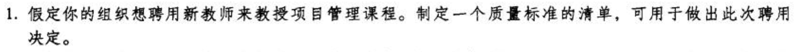
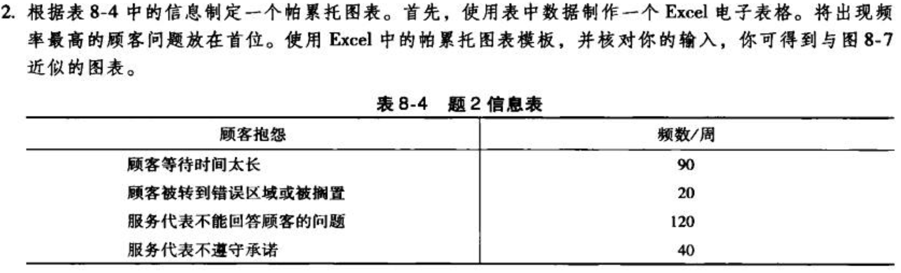
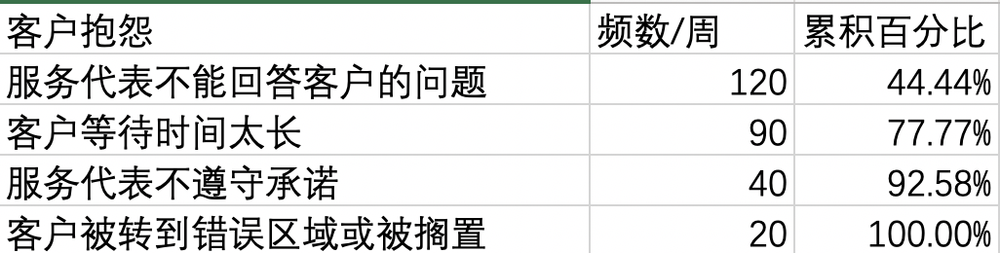
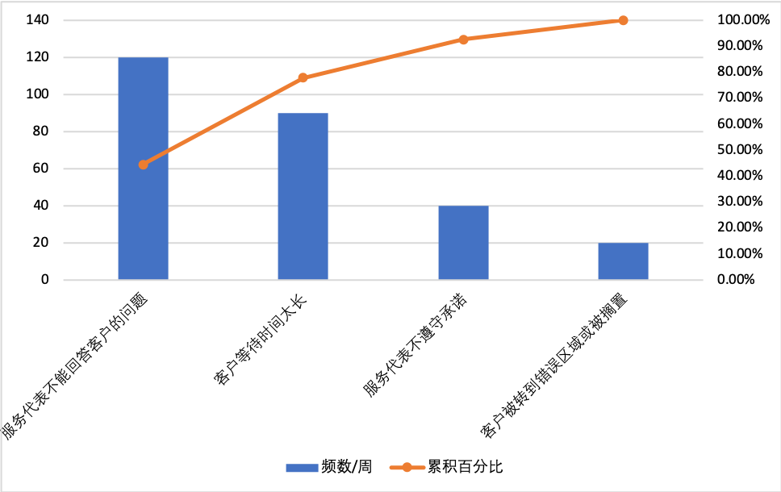
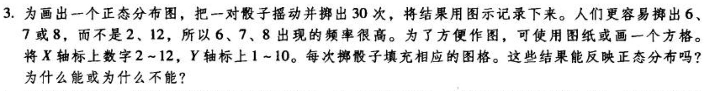
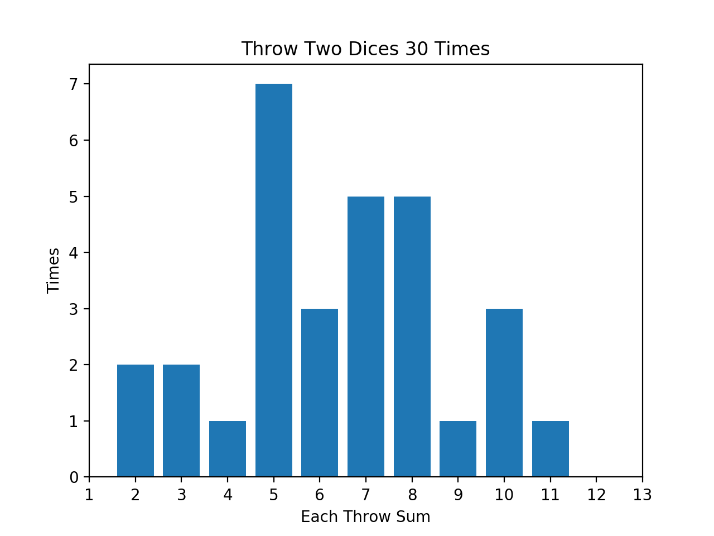
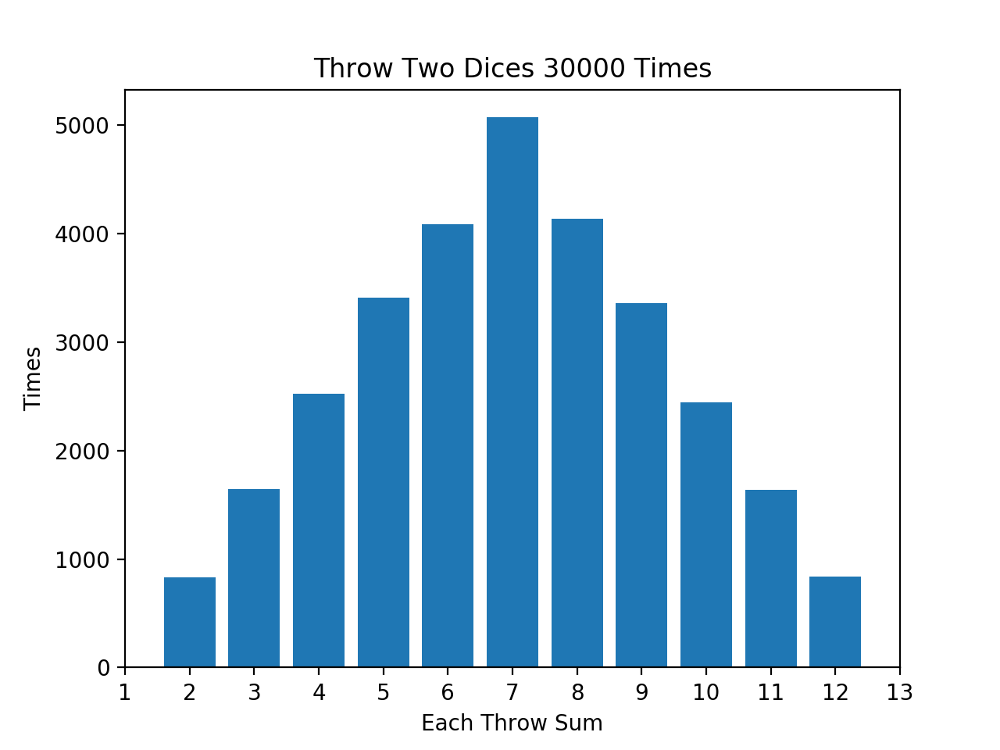

# 项目质量管理 练习

- [项目质量管理 练习](#项目质量管理-练习)
  - [一、教材练习题1（P198 1.）](#一教材练习题1p198-1)
    - [质量标准清单1：](#质量标准清单1)
    - [质量标准清单2：](#质量标准清单2)
  - [二、教材练习题2（P198 2.）](#二教材练习题2p198-2)
    - [1. Excel表格](#1-excel表格)
    - [2. 帕累托图](#2-帕累托图)
  - [三、教材练习题3（P198 3.）](#三教材练习题3p198-3)

## 一、教材练习题1（P198 1.）

题目：

教师应满足质量标准清单1所述资质，或满足质量标准清单2所述资质。

### 质量标准清单1：
1. 管理学博士以上学历；
2. 3年以上项目管理课程教学经验；
3. 保证在18周，每周2学时的课程时间安排下，完成所有教学内容；
4. 以“参加创新项目竞赛”为标准，引导班级学生在课程中完成1个项目；
5. 课程结束后，班上至少有50%的学生报名参加创新项目竞赛；
6. 班级至少有3组学生获得创新项目竞赛三等奖以上的奖项；

### 质量标准清单2：
1. 500强企业项目经理在职，5年以上项目经理工作经验；
2. 至少拥有1段作为项目管理课程讲师的经历；
3. 在一学期内，保证每周有2学时的时间可以到校给学生上课；
4. 保证在18周，每周2学时的课程时间安排下，完成所有教学内容；
5. 课程结束后，班上至少有30%的学生投递企业项目经理实习岗位；
6. 班上至少有5%的学生进入500强企业的项目管理岗位实习；

## 二、教材练习题2（P198 2.）
题目：

### 1. Excel表格

### 2. 帕累托图

## 三、教材练习题3（P198 3.）

题目：

代码见Github仓库，本目录下的[E3_dice.py](./E3_dice.py)

将一对骰子掷30次，统计每次结果的频数：

将一对骰子掷30000次，统计每次结果的频数：

这样的分布不是正态分布，随着试验次数的增多，横轴每个数字对应的条形长度间的比值，接近与每个数字出现的概率之比。例如：
- 一次投掷，出现结果为2的概率为：1 / 36
- 一次投掷，出现结果为3的概率为：1 / 18
随着试验次数的增多，在图中，3的条形长度将会是2的条形长度的两倍。

“投掷一对骰子”的概率分布表如下：
| Result 	| 2    	| 3    	| 4    	| 5    	| 6    	| 7    	| 8    	| 9    	| 10   	| 11   	| 12   	|
|--------	|------	|------	|------	|------	|------	|------	|------	|------	|------	|------	|------	|
| P      	| 1/36 	| 2/36 	| 3/36 	| 4/36 	| 5/36 	| 6/36 	| 5/36 	| 4/36 	| 3/36 	| 2/36 	| 1/36 	|

这样的概率分布只能描述这种“投掷一对骰子”的场景，无法代表正态分布。

但根据**中心极限定理**：大量独立的同分布的随机因素，如果各项因素都不能起到主导作用，那么这些因素的共同影响结果，就服从正态分布。例如，投掷掷12颗骰子，投10000次。
